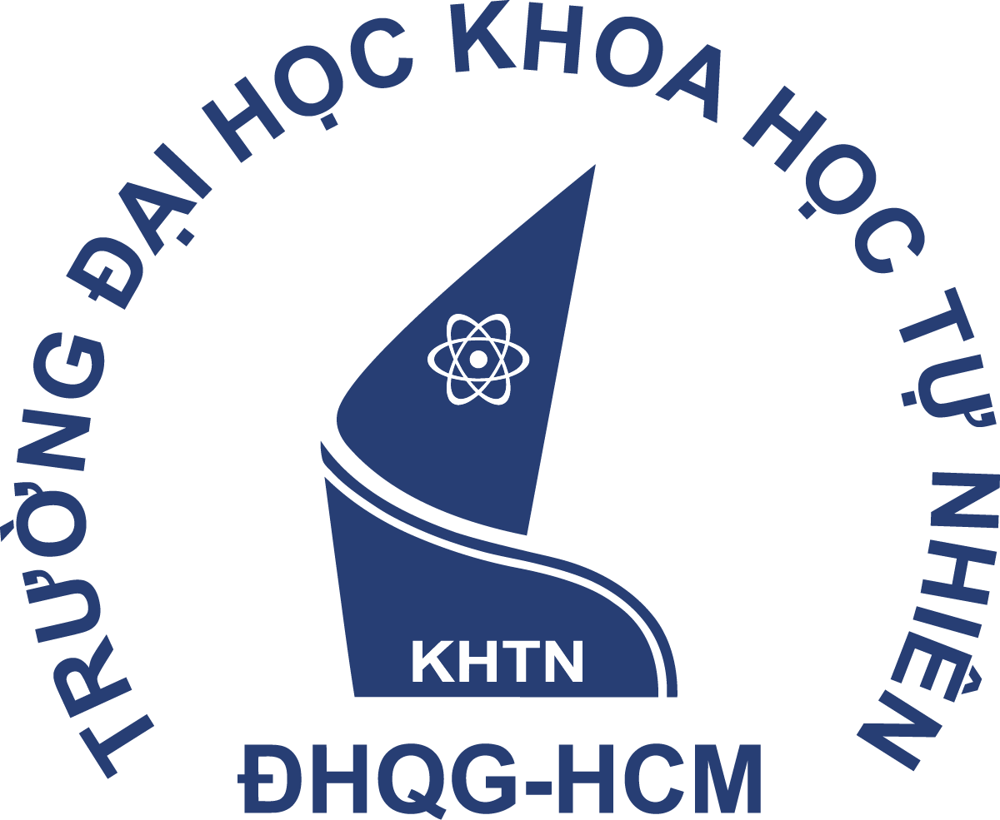

## <div align="center">__ĐẠI HỌC QUỐC GIA THÀNH PHỐ HỒ CHÍ MINH__ </div>
## <div align="center">__TRƯỜNG ĐẠI HỌC KHOA HỌC TỰ NHIÊN__ </div>
## <div align="center">__KHOA CÔNG NGHỆ THÔNG TIN__ </div>

<p align="center">
  
</p><br>

## <div align="center"> <font size = "7">__`20127643-TRƯƠNG GIA TIẾN`__ </div> </font><br>
## <div align="center">__| ĐỒ ÁN THỰC HÀNH |__</div>
## <div align="center"> <font size = "7">__`COLOR COMPRESSION`__ </div> </font><br>
##  <div align="center">__Giảng viên hướng dẫn:__ </div>
### <div align="center">Thầy Vũ Quốc Hoàng</div>
### <div align="center">Thầy Nguyễn Văn Quang Huy</div>
### <div align="center">Thầy Lê Thanh Tùng</div>
### <div align="center">Cô Phan Thị Phương Uyên</div>
<br>

### <div align="center">__Môn: Toán ứng dụng và thống kê cho Công nghệ thông tin__</div>
<br>
<div align="center">Thành phố Hồ Chí Minh - 2022 </div>

<div style="page-break-after: always;"></div>


# __Ý TƯỞNG__
## __Về KMEANS__
Về cơ bản, thuật toán KMeans trong đồ án này là tìm ra các vị trí tối ưu, chính xác nhất của các centroid để phân ra thành nhiều cụm pixel có màu gần giống hoặc giống nhau.<br>

1. Khởi tạo k centroid ngẫu nhiên để làm các điểm centroid bắt đầu (initial centroids)
2. Reshape lại mảng hình ảnh từ 3D thành 2D với mỗi dòng trong mảng 2D là 1 pixel.
3. Với mỗi pixel có trong ảnh, tính khoảng cách từ pixel đó tới tất cả các centroid và 
4. Đối với từng pixel, xác định centroid có khoảng cách ngắn nhất tới pixel đó và tiến hành gán nhãn (tên) cho pixel tương ứng với centroid đó
5. Tính trung bình cho từng centroid tương ứng với các pixel đã được gán vào các centroid đó
6. Update lại centroid mới tương ứng với các trung bình của nó như đã tính ở bước "3"
7. Lặp lại các bước trên cho đến khi hết số lần lặp cho phép hoặc khi centroid sau giống hoặc gần giống như centroid trước đó (sự hội tụ, điểm dừng)
8. Gán các pixel với giá trị của các centroid tương ứng với chúng theo nhãn
9. reshape lại mảng hình thành 3D và xuất ra hình
<br>

# __CÁC HÀM__
### Hàm KMEANS
```python
def kmeans(img_1d, k_clusters, max_iter, init_centroids='random'):
    np.seterr(invalid='ignore')

    height, width, depth = img_1d.shape

    reshapedIMG = img_1d.reshape(height * width, depth)
    reshapedHeight, reshapedWidth = reshapedIMG.shape
    
    if init_centroids == "random":
        centroids = np.random.choice(256, size=(k_clusters, reshapedWidth))
    elif init_centroids == "in_pixels":
        indexArray = np.random.choice(reshapedHeight, k_clusters)
        centroids = np.zeros((k_clusters, reshapedWidth), dtype="int")
        for i in range(k_clusters):
            centroids[i] = reshapedIMG[indexArray[i]]

    for _ in range(max_iter):
        prevCentroid = centroids

        dist = np.zeros((reshapedHeight, k_clusters))
        for k in range(k_clusters):
            vectorSubtract = np.subtract(reshapedIMG, prevCentroid[k])
            vectorNorm = np.linalg.norm(vectorSubtract, axis=1)
            
            for i in range(reshapedHeight):
                dist[i][k] = vectorNorm[i]
                
        label = np.zeros((reshapedHeight), dtype="int")
        for i in range(len(label)):
            label[i] = np.argmin(dist[i], axis=0)

        for k in range(k_clusters):
            imgOfCentroid = reshapedIMG[label == k]

            if np.all(imgOfCentroid != imgOfCentroid):
                centroids[k] = np.random.choice(256, size=(1, reshapedWidth))
            else:
                centroids[k] = np.nanmean(imgOfCentroid, axis=0)

        if np.allclose(prevCentroid, centroids, atol=2):
            break
    
    return label, centroids
```

### __GIẢI THÍCH HÀM KMEANS__
```python
np.seterr(invalid='ignore')

height, width, depth = img_1d.shape
reshapedIMG = img_1d.reshape(height * width, depth)
reshapedHeight, reshapedWidth = reshapedIMG.shape
```
Gọi hàm `seterr` để bỏ qua một số warning trong lúc thực thi chương trình.
Hàm _`shape`_ trong `numpy` để lấy 3 thông số của ảnh là height (dòng), width (cột), depth (hay còn gọi là channel).
Do ảnh RGB nếu quy ra kiểu array sẽ là mảng 3 chiều (3D) nên trước khi xử lý ta dùng hàm _`reshape`_ trong `numpy` để chuyển về thành mảng 2 chiều (2D), mảng mới này sẽ có số dòng/height mới là __width * height__ của mảng cũ, nghĩa là mỗi dòng của mảng mới tương ứng với 1 pixel của hình gốc.
Sau đó ta dùng hàm `shape` để lấy height, width của mảng hình mới.

---
```python
if init_centroids == "random":
    centroids = np.random.choice(256, size=(k_clusters, reshapedWidth))
elif init_centroids == "in_pixels":
    indexArray = np.random.choice(reshapedHeight, k_clusters)
    centroids = np.zeros((k_clusters, reshapedWidth), dtype="int")
    for i in range(k_clusters):
        centroids[i] = reshapedIMG[indexArray[i]]
```
Tiếp đến là khởi tạo __k centroid__ ngẫu nhiên theo giá trị __k_cluster__ cho trước.
Dùng `if` để kiểm tra tham số `init_centroids` truyền vào là loại gì để khởi tạo __centroid__ theo đúng ý người nhập:

- `"random"`: dùng hàm `random.choice` của `numpy` để tạo một array có __k__ dòng/vector mỗi dòng/vector có 3 phần tử tương ứng với RGB và giá trị của mỗi phần tử này sẽ được chạy random từ __0-255__
- `"in_pixels"`: dùng hàm `random.choice` của `numpy` để chọn ngẫu nhiên __k__ pixel có trong hình mà ta đã __reshape__. Đầu tiên là chọn vị trí của pixel, ta được một mảng mới là `indexArray` chứa chỉ mục của các pixel đó, sau đó ta gán __centroid__ với các pixel tương ứng.

---

```python
 for _ in range(max_iter):
    prevCentroid = centroids

    dist = np.zeros((reshapedHeight, k_clusters))
    for k in range(k_clusters):
        vectorSubtract = np.subtract(reshapedIMG, prevCentroid[k])
        vectorNorm = np.linalg.norm(vectorSubtract, axis=1)
        
        for i in range(reshapedHeight):
            dist[i][k] = vectorNorm[i]
            
    label = np.zeros((reshapedHeight), dtype="int")
    for i in range(len(label)):
        label[i] = np.argmin(dist[i], axis=0)

    for k in range(k_clusters):
        imgOfCentroid = reshapedIMG[label == k]

        if np.all(imgOfCentroid != imgOfCentroid):
            centroids[k] = np.random.choice(256, size=(1, reshapedWidth))
        else:
            centroids[k] = np.nanmean(imgOfCentroid, axis=0)

    if np.allclose(prevCentroid, centroids, atol=2):
        break
```
Đây là vòng lặp chính và quan trọng nhất của cả hàm __Kmeans__, tác dụng của vòng lặp này  là tính toán vị trí chính xác nhất của __k centroid__ đối với các cụm pixel có màu gần hoặc giống nhau trong hình.
Đầu tiên gán `prevCentroid = centroids` để đến cuối vòng lặp `max_iter` ta sẽ kiểm tra sự hội tụ. 

---

```python
dist = np.zeros((reshapedHeight, k_clusters))
for k in range(k_clusters):
    vectorSubtract = np.subtract(reshapedIMG, prevCentroid[k])
    vectorNorm = np.linalg.norm(vectorSubtract, axis=1)
    
    for i in range(reshapedHeight):
        dist[i][k] = vectorNorm[i]
```
Khởi tạo biến `dist` là một __array__ để chứa khoảng cách của các __pixel__ so với từng __k centroid__. `dòng` tương ứng với __pixel__ và mỗi dòng có __k__ phần tử tương ứng với __k centroid__ 
Vòng lặp này dùng để tính khoảng cách giữa __pixel__ so với __k centroid__
Đối với mỗi __centroid__, trước tiên ta lấy mảng hình ảnh `reshapedIMG` `-(trừ)` `centroid[k]` bằng hàm `subtract`, ta được một __mảng chứa các vector mới sau khi trừ `centroid[k]`__ của từng pixel.
Sau đó ta dùng hàm `norm` để tính độ dài của mảng mới này, do ta đã lấy `reshapedIMG` `-` `centroid[k]` nên độ dài của vector chính là khoảng cách từ `centroid[k]` đến tất cả các __pixel__ của hình. Mỗi __phần tử (element)__ trong `vectorNorm` tương ứng với 1 __pixel__
Vòng lặp tiếp theo, gán những giá trị độ dài đã tính trên vào mảng dist. `dist[i][k] = vectorNorm[i]` có `dòng [i]` là __pixel__ và `cột [k]` là __centroid thứ k__. Nghĩa là gán giá trị khoảng cách `vectorNorm[i]` cho vị trí thứ [k] của pixel [i]

---

```python
label = np.zeros((reshapedHeight), dtype="int")
for i in range(len(label)):
    label[i] = np.argmin(dist[i], axis=0)
```
Khởi tạo mảng `label` có kiểu int và size là `reshapedHeight <-> tổng số pixel` để chứa các nhãn cho tất cả pixel. 
Đối với từng pixel, nhãn là chỉ số __k__ của centroid gần nhất đối với pixel đó. Trong vòng lặp, dùng hàm `argmin` để tìm độ dài `norm` nhỏ nhất của từng pixel. Ta được chỉ số __k__ của centroid gần nhất của pixel đó

---

```python
for k in range(k_clusters):
    imgOfCentroid = reshapedIMG[label == k]

    if np.all(imgOfCentroid != imgOfCentroid):
        centroids[k] = np.random.choice(256, size=(1, reshapedWidth))
    else:
        centroids[k] = np.nanmean(imgOfCentroid, axis=0)
```
Vòng lặp này dùng để cập nhật lại vị trí mới cho __centroid__ bằng cách tính và lấy giá trị trung bình của các pixel gần centroid đó.
`imgOfCentroid` là mảng chứa các pixel gần  __centroid k__ đang xét, gán  `imgOfCentroid` với mảng các pixel nằm trong mảng hình ảnh `reshapedIMG` có nhãn-`label` tương ứng với số __k__ của centroid đang xét.
Câu điều kiện `if` dùng để kiểm tra mảng `imgOfCentroid` có trống hay không (có chứa __NAN__) --> __centroid thứ k__ mà ta đang xét không có pixel nào nằm gần nó, hay chính xác hơn là __centroid__ này chứa các màu RGB không gần giống hoặc giống với tất cả các pixel của hình (__`Theo tôi, trường hợp này chỉ xảy ra khi init_centroid là random bởi vì các màu của random đc khởi tạo là ngẫu nhiên, không theo màu của bất cứ pixel nào như in_pixels, vì vậy centroid được khởi tạo có thể không có pixel nào có màu nằm gần`__).

---

```python
if np.allclose(prevCentroid, centroids, atol=2):
    break
```
Kiểm tra sự hội tụ, đó là khi centroid trước và centroid hiện tại vừa mới update gần giống hoặc giống nhau hoàn toàn. Lúc này có nghĩa là các __centroid__ đã ở vị trí cuối cùng hoặc gần như là cuối cùng. Vì thế nên ta `break` vòng lặp _ite_

---
### HÀM assignNewImg
```python
def assignNewImg(img, label, centroid):
    height, width, depth = img.shape

    reshapedIMG = img.reshape(height * width, depth)

    for k in range(len(centroid)):
        reshapedIMG[label == k] = centroid[k]
        
    reshapedIMG = reshapedIMG.reshape(height, width, depth)

    return reshapedIMG
```
Đối với mỗi pixel trong mảng `reshapedIMG` có nhãn tương ứng với __k__ thì ta gán giá trị của pixel đó là `centroid[k]` đó.
Cuối cùng `reshape` lại mảng thành 3D như lúc ban đầu để có thể xuất hình

---
### MAIN
```python
def main():
    imgName = input("Enter image name: ")
    k_clus = input("Enter k_cluster value: ")
    maxIte = input("Enter max iterator (int): ")
    initType = input("Enter init_centroid (random, in_pixels): ")
    newImgName = input("Enter image save name: ")

    if newImgName[len(newImgName) - 4] != '.':
        imgExt = input("Enter new image extension (jpg, png, pdf): ")
        newImgName = newImgName + '.' + imgExt

    img = pil.Image.open(imgName)
    npArray = np.array(img)

    label, centroids = kmeans(npArray, k_clusters=int(k_clus), max_iter=int(maxIte), init_centroids=initType)
    
    newIMG = assignNewImg(npArray, label, centroids)
    plt.imshow(newIMG)

    plt.imsave(newImgName, newIMG)

    print("label array: ")
    print(label)

    print("Centroids: ")
    print(centroids)
```
Hàm main dùng để nhập:
- Tên ảnh muốn mở, nhập
- Nhập chỉ số k_cluster
- Nhập số lần lặp (max_iter)
- Nhập kiểu centroid khởi tạo (init_centroid)
- Nhập tên ảnh mới để save
- Nhập extension của ảnh mới<br>

Hàm main output ra:
- mảng label
- mảng centroid cuối cùng
- Xuất hình ảnh đã được giảm chất lượng tương ứng với số k

<br>

# __KẾT QUẢ__
## <div align="center">  __ẢNH GỐC (261*158)__</div>

<p align="center">
  
</p>

<div align="center">__K values__</div>|<font size = "100">__3__</font>|<font size = "100">__5__</font>|<font size = "100">__7__</font>
-|-|-|-|
<div align="center">__RANDOM__</div>|||
<div align="center">__IN_PIXELS__</div>|||

<div style="page-break-after: always;"></div>

## K KHÁC 3,5,7
<div align="center">__K values__</div>|<font size = "100">__20__</font>|<font size = "100">__50__</font>|<font size = "100">__80__</font>
-|-|-|-|
<div align="center">__RANDOM__</div>|||
<div align="center">__IN_PIXELS__</div>|||

# NHẬN XÉT KẾT QUẢ
Đối với các kết quả trên, ta thấy rằng với k tăng dần thì hình ngày càng nhìn rõ ràng, nét hơn với màu đẹp hơn và gần giống hình với hình gốc.
Nếu ta so sánh `init_centroid` là `random` và `in_pixels` thì rõ ràng, đối với tất cả các __k__ được show ở trên (k=3,5,7) thì chất lượng của `random` là hơn hẳn so với `in_pixels`
Nhưng nếu __k__ càng lớn thì chất lượng của `in_pixels` sẽ càng tốt hơn so với `random` có cùng __k__ như ví dụ (k=20,50,80).
Điều trên có thể được lý giải như sau: `in_pixels` có init_centroid sẽ những pixel của hình, vì vậy nên càng nhiều centroid k thì hình sẽ càng rõ nét do là các centroid được khởi tạo bởi các màu đúng có sẵn trong hình. Còn `random` do khởi tạo các màu theo kiểu ngẫu nhiên nên mang tính ngẫu nhiên cũng sẽ nhiều hơn, có những trường hợp màu được khởi tạo sẽ đúng, giống hoặc gần với màu có trong hình, nhưng cũng có thể xa hoặc thậm chí rất xa màu giống trong hình, nên khi lấy trung bình thì không thể đúng và giống hoàn toàn được.

# TÀI LIỆU THAM KHẢO
- [Numpy random](https://www.w3schools.com/python/numpy/numpy_random.asp)
- [Numpy reshape](https://www.w3schools.com/python/numpy/numpy_array_reshape.asp)
- [Numpy mean](https://numpy.org/doc/stable/reference/generated/numpy.mean.html)
[Kmeans algorithm](https://nguyenvanhieu.vn/thuat-toan-phan-cum-k-means/)
- `https://towardsdatascience.com/understanding-k-means-k-means-and-k-medoids-clustering-algorithms-ad9c9fbf47ca`
- `https://towardsdatascience.com/image-compression-using-k-means-clustering-aa0c91bb0eeb`
- `https://towardsdatascience.com/k-means-clustering-algorithm-applications-evaluation-methods-and-drawbacks-aa03e644b48a#:~:text=Kmeans%20algorithm%20is%20an%20iterative,belongs%20to%20only%20one%20group.`
- `https://www.unioviedo.es/compnum/labs/new/kmeans.html#:~:text=K%2Dmeans%20is%20an%20unsupervised,the%20group%20or%20cluster%20centroid.`
- `https://www.youtube.com/watch?v=F1iVeGeYBMA`
- `https://en.wikipedia.org/wiki/K-means_clustering`